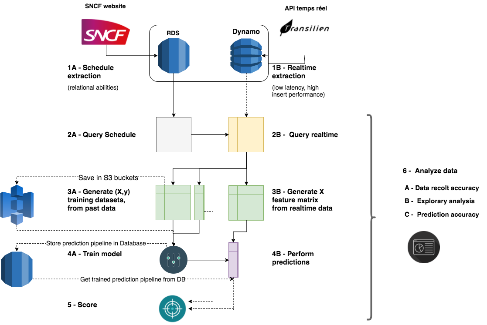

# API TRANSILIEN

## Overview

This repository is part of a broader project with SNCF’s R&D department to provide arrival time predictions for trains in Paris area.

A repository details how this project is deployed through Vagrant and Salt automation tools.

Another details details how the website and the API built for this project work.

## Overview



## What it does

#### Task 1: scheduled departure times (from SNCF website in GTFS format):

- download schedules from SNCF website (csv format)
- save it in relational database (optionally)
- find each day which trips should pass, and at what time trains should pass in stations
- save it in Dynamo ‘scheduled_departures’ table

#### Task 2: real departure times (from Transilien’s API)

- extract data from transilien’s api
- transform XML received by api into json serializable objects
- query Dynamo ‘scheduled_departures’ table (can also query Postgres, but is much slower) to find out for each train predicted to arrive in a station, which trip_id is linked, and at what time it was scheduled to arrive.
- enrich these objects
- save it in Dynamo ‘real_departures’ table


## Documentation

You will find detailed documentation here.
[HERE](https://leonardbinet.github.io/)

## SSH reminder
```
ssh -i "~/.ssh/aws-eb2" ubuntu@34.251.124.59
```

### Configuration

Either use [salt-vagrant repository](https://github.com/leonardbinet/Salt-Vagrant-master-mode) explaining how to set this project up.

Or create secret.json file: this is the file where the application will find credentials for the different apis.

You have to create a JSON file in the root directory (same level as main.py):
```
{
    "API_USER" : "your_api_user",
    "API_PASSWORD" : "your_api_password",

    "AWS_ACCESS_KEY_ID":"***",
    "AWS_SECRET_ACCESS_KEY":"***",
    "AWS_DEFAULT_REGION":"eu-west-1"
}
```


## Documentation
To generate documentation:

First activate your virtualenv (you should have Sphinx and sphinx_rtd_theme installed), from root directory:
```
# create structure
sphinx-apidoc --separate -f -o docs api_etl

# generate html
cd docs
make html
```
You will find documentation in `docs/_build` directory

*Warning*: beware of secrets. If your secrets are set in the secret.json file, they might be exposed through `get_secret` function parameters in documentation.

## How to get prediction matrices:

```
git clone https://github.com/leonardbinet/Transilien-Api-ETL.git
```

Then create virtual env:
```
conda create -n api_transilien python=3
source activate api_transilien
pip install -r requirements.txt
pip install ipython
# because of pull-request not yet accepted for bug correction:
pip install -e git+git://github.com/leonardbinet/PynamoDB.git@master#egg=pynamodb
```

Then setup secret file `secret.json`:
```
{
    "AWS_ACCESS_KEY_ID":"***",
    "AWS_SECRET_ACCESS_KEY":"***",
    "AWS_DEFAULT_REGION":"eu-west-1",

    "RDB_TYPE": "****",
    "RDB_USER": "****",
    "RDB_DB_NAME": "****",
    "RDB_PASSWORD":"****",
    "RDB_HOST":"****",
    "RDB_PORT":"****",

    "MONGO_HOST":"****",
    "MONGO_USER":"****",
    "MONGO_DB_NAME":"****",
    "MONGO_PASSWORD":"****"
}
```

Enjoy matrix:
```
# launch ipython
=> ipython
Python 3.6.0 |Continuum Analytics, Inc.| (default, Dec 23 2016, 13:19:00)
Type "copyright", "credits" or "license" for more information.

IPython 5.1.0 -- An enhanced Interactive Python.
?         -> Introduction and overview of IPython's features.
%quickref -> Quick reference.
help      -> Python's own help system.
object?   -> Details about 'object', use 'object??' for extra details.

In [1]: run api_etl/prediction.py

In [2]: dmb = DayMatrixBuilder(day="20170406", time="16:20:00")
# This will take between 5 and 10 minutes
# Here we the prediction matrices will be computed based on situation
# at time 20170406-16:20:00:
2017-04-21 16:55:20,361 - root - INFO - Building Matrix for day 20170406 and time 16:20:00 (retroactive: True)
2017-04-21 16:55:20,361 - root - INFO - Launched schedule request.
2017-04-21 16:58:04,411 - root - INFO - Schedule queried.
2017-04-21 16:59:38,486 - root - INFO - RealTime queried.
2017-04-21 17:00:18,382 - root - INFO - Initial dataframe created.
2017-04-21 17:00:26,307 - root - INFO - Initial dataframe cleaned.
2017-04-21 17:01:01,827 - root - INFO - TripState computed.
2017-04-21 17:01:05,173 - root - INFO - Trip level computations performed.
2017-04-21 17:01:06,745 - root - INFO - Line level computations performed.
2017-04-21 17:01:14,632 - root - INFO - Labels assigned.

In [3]: dmb.stats()
# Summary of collected data

        SUMMARY FOR DAY 20170406 AT TIME 16:20:00 (RETROACTIVE: True)

        TRIPS
        Number of trips today: 9297
        Number of trips currently rolling: 431 (these are the trips for which we will try to make predictions)
        Number of trips currently rolling for which we observed at least one stop: 178

        STOPTIMES
        Number of stop times that day: 129024
        - Passed:
            - scheduled: 75553
            - observed: 24791
        - Not passed yet:
            - scheduled: 53471
            - observed (predictions on boards) 17053

        STOPTIMES FOR ROLLING TRIPS
        Total number of stops for rolling trips: 7658
        - Passed: those we will use to make our prediction
            - scheduled: 3572
            - observed: 1203
        - Not passed yet: those for which we want to make a prediction
            - scheduled: 4086
            - already observed on boards (prediction): 1173

        PREDICTIONS
        Number of stop times for which we want to make a prediction (not passed yet): 4086
        Number of trips currently rolling for which we observed at least one stop: 178
        Representing 1768 stop times for which we can provide a prediction.

        LABELED
        Given that retroactive is True, we have 1096 labeled predictable stoptimes for training.

In [4]: d = dmb.get_predictable(col_filter_level=3,labeled_only=True)
# Get matrices in a dictionary ("X","y_real","y_naive_pred")

In [5]: d.keys()
Out[5]: dict_keys(['X', 'y_real', 'y_naive_pred'])
# Naive pred is delay from last observed station.
```

## Debug

```
cat /var/log/syslog
```
Or better:
```
grep CRON /var/log/syslog
```
Check what will be run:
```
run-parts --test /etc/cron.hourly
```

```
ps -ef
ps -p "5513" -o etime=
```
To kill: brutal(replace number by id from last command)
```
sudo pkill -9 5513
```
